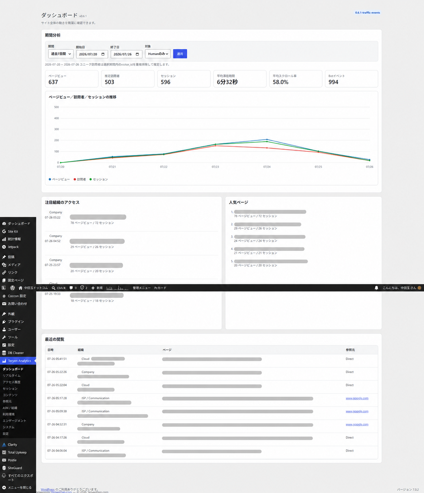

English | [日本語](README.ja.md)

# Tenyen Analytics for WordPress

## Overview

Tenyen Analytics is a self-hosted WordPress analytics plugin for pageviews, estimated unique visitors, sessions, engagement, referrers, audience details, GeoLite2 location and ASN insights, and bot detection. Analytics reports stay in WordPress and do not require an external analytics service.



## Features

- Pageviews, estimated unique visitors, sessions, duration, scroll depth, external clicks, and downloads
- Human/Bot filters and locally rendered charts
- Encrypted raw IP storage and HMAC-based exact-match IP search
- Local GeoLite2 City and ASN lookup with an optional official MaxMind reader
- Asynchronous access history and a compact WordPress Dashboard widget
- Notable-organization categories while preserving MaxMind organization names verbatim
- Administrator aliases, plain-text notes, reusable tags, organization watchlists, and private saved views
- Prospective collection exclusions, non-destructive analysis exclusions, and rule diagnostics

## Requirements

- WordPress 6.2 or later
- PHP 8.1 or later

## Installation

Upload the release ZIP in **Plugins → Add New → Upload Plugin**, or copy the `tenyen-analytics-wordpress` directory to `wp-content/plugins/`, then activate it.

## GeoLite2 setup

GeoLite2 MMDB files are not included. The site administrator must obtain `GeoLite2-City.mmdb` and `GeoLite2-ASN.mmdb` under [MaxMind's terms](https://www.maxmind.com/) and place them in `wp-content/uploads/tenyen-analytics/`, or configure their paths in the plugin. Basic collection works without them.

## Dashboard and reports

The Tenyen Analytics menu contains Dashboard, Real-time, Access History, Sessions, Content, Referrers, ASN / Organizations, Knowledge, Exclusions, Audience, Engagement, System, and Settings. The standard WordPress Dashboard widget loads its totals asynchronously and is visible only to administrators with `manage_options`.

## Privacy and security

Raw IP addresses are stored using reversible encryption; HMAC values support exact-match searches. Protection keys are derived from WordPress salts, so changing salts prevents old encrypted IPs from being decrypted. GeoLite2 queries are local. ASN organization names describe the registrant of an address range and do not prove a visitor's employer or affiliation. Administrators should disclose collection and retention in their privacy policy. Uninstall preserves analytics data unless an administrator removes it manually.

## Updating

Back up WordPress, then overwrite or upload the new plugin version. Keep GeoLite2 files in the uploads directory. Version 0.6.3 adds a separate exclusion-rule table and preserves all v0.6.2 analytics and metadata rows.

## Exclusion rules

The administrator-only Exclusions screen supports exact IPv4/IPv6, CIDR, exact path, path prefix, administrator/self, Bot, country, region, ASN, organization/category, browser, OS, device, referrer-domain, and UTM source/medium/campaign rules. Collection rules prevent matching future requests from being stored. Analysis rules hide matching stored rows from reports, history, sessions, and widgets without deleting them. CIDR, administrator, and organization-category rules are collection-only because the current historical schema cannot apply them in bounded SQL queries.

Rules have a deterministic type precedence followed by rule ID. The diagnostic form identifies the first matching rule, precedence, action, and reason. Rule values and notes are bounded plain text; administrative routes require `manage_options` and a valid WordPress REST nonce. Existing **Exclude administrator access** and **Record bots as well** settings remain collection controls. Historical data is never automatically deleted by exclusion management.

## Administrator knowledge

The Knowledge screen manages aliases, notes (up to 4,000 characters), tags (up to 50 characters and 50 per entity), watched ASN organizations, and private saved views. Supported identities are numeric ASN, the existing anonymous visitor ID, post ID or canonical content path, normalized referrer domain, a deterministic hash of the five first-touch UTM dimensions, and normalized external target domain. Aliases never overwrite raw values. Orphaned annotations remain manageable.

Watching only marks and filters an ASN; it sends no notification and changes no analytics fact. Access was observed from an IP address registered to the ASN/organization—it does not identify a person, employment, affiliation, or intent. Saved views belong to one WordPress administrator. Relative date presets are recalculated when loaded; custom dates remain absolute. Pinned and one-per-report default states are supported by the storage/API model. Uninstall preserves the metadata and exclusion-rule tables under the existing data-retention policy. Notifications remain deferred.

## Traffic attribution and events

Each session uses first-touch attribution from its first stored pageview. A recognized UTM source, medium, or campaign is classified as Campaign; otherwise traffic is Direct, Internal, Organic Search, Social, Referral, or Unknown. Supported fields are `utm_source`, `utm_medium`, `utm_campaign`, `utm_content`, and `utm_term`.

External links and configured download extensions are tracked automatically without double-counting a download as an external click. Internal-link and generic-button tracking are disabled by default. Form tracking is conservative and requires configuration or `data-tenyen-track`; field values are never collected. WordPress 404 requests produce `not_found` instead of an ambiguous pageview.

Custom integrations can call:

```javascript
window.TenyenAnalytics.trackEvent('radio_play', {station: 'example-station', server: 'primary'});
window.TenyenAnalytics.trackEvent('stream_server_change', {server: 'backup'});
window.TenyenAnalytics.trackEvent('feature_used', {area: 'header'});
```

The method returns whether the payload was accepted locally for transport. Delivery is best-effort. Names, metadata keys/counts, scalar values, and lengths are bounded; functions, DOM nodes, nested and cyclic values are rejected. These examples do not install radio integration automatically.

## Session and visitor journeys

The administrator-only Sessions screen lists stored sessions and opens ordered event journeys asynchronously. Stored `session_id` values are canonical; legacy events without one remain available in Access History but are not inferred into sessions. Anonymous visitor summaries use the existing browser-dependent `visitor_id` and must not be treated as proof of a person’s identity.

Engaged time uses the maximum cumulative engagement duration for each session and path. A bounce is a session with exactly one pageview. For content, bounce rate is bounced entry sessions divided by entry sessions, and exit rate is sessions exiting on the page divided by that page’s pageviews. These metrics are estimates and safely return zero when their denominator is zero.

## Troubleshooting

Use **Tenyen Analytics → System** to check collection endpoints and GeoLite2 status. If location or ASN fields are empty, verify that both MMDB paths are readable. If no events appear, check page caching/security rules and the browser network response from the collection endpoint.

## Development

Run `composer validate --strict`, lint PHP with `find . -name '*.php' -not -path './vendor/*' -print0 | xargs -0 -n1 php -l`, check JavaScript with `find assets -name '*.js' -print0 | xargs -0 -n1 node --check`, and build with `tools/build-release.sh`.

## License

Copyright © 10yendama.com. Licensed under GPL-2.0-or-later. See [LICENSE](LICENSE). See [THIRD-PARTY-NOTICES.md](THIRD-PARTY-NOTICES.md) for optional components.
